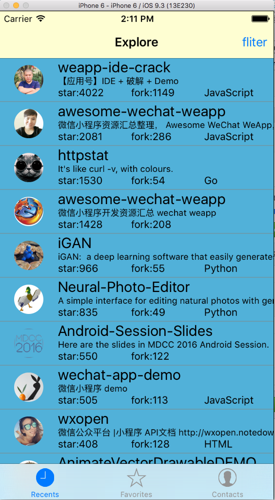

这是一个github客户端，用react-native搭建，仅做学习使用。

## screenshot

## 问题

  （1）为了简化Authorization，本项目没有采用oauth，而是直接用用户名密码来实现
  （2）本项目没有使用realm或者其他的本地数据库，只是采用AsyncStorage来简单存储用户个人信息

## 实现的基本功能

  搜索最近的新鲜项目
  用户登录，用户信息查询
  repo详情
  用户star查询

## todo（骗谁啊）

  加oauth2
  加notification模块
  美化

## license
take every single line code if you want.
